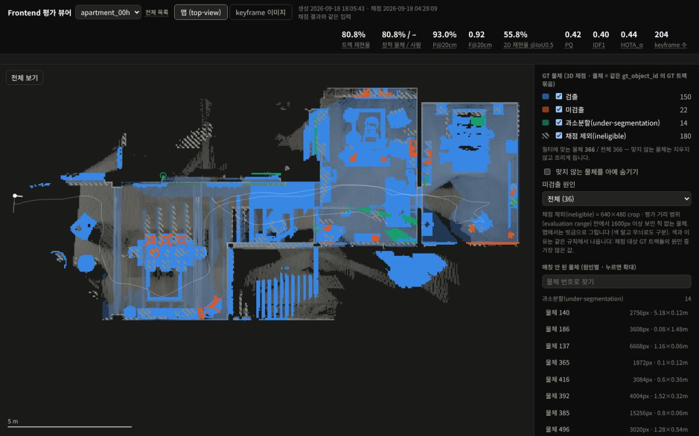
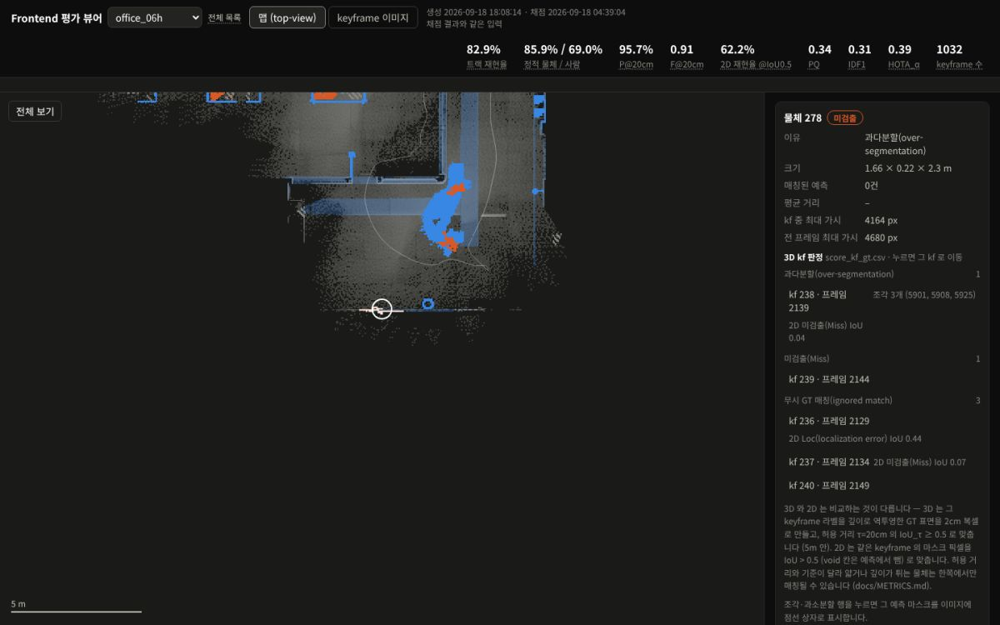
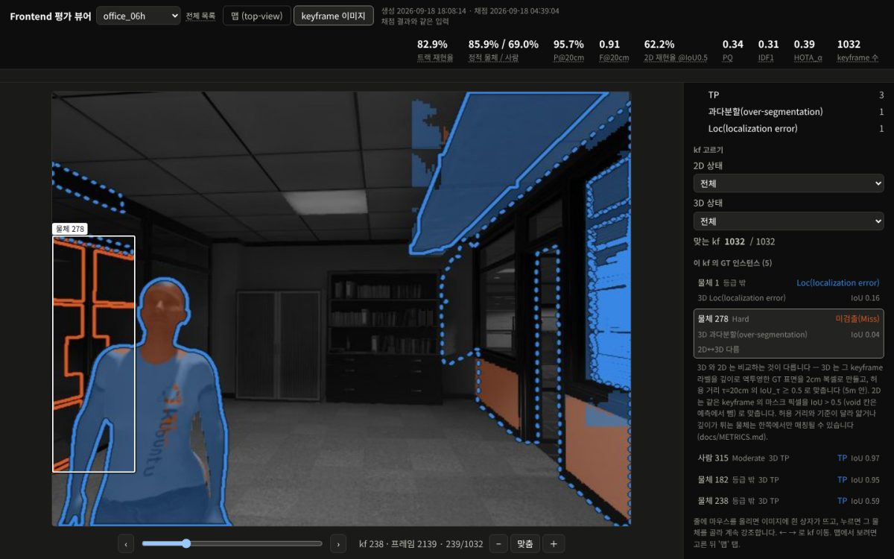
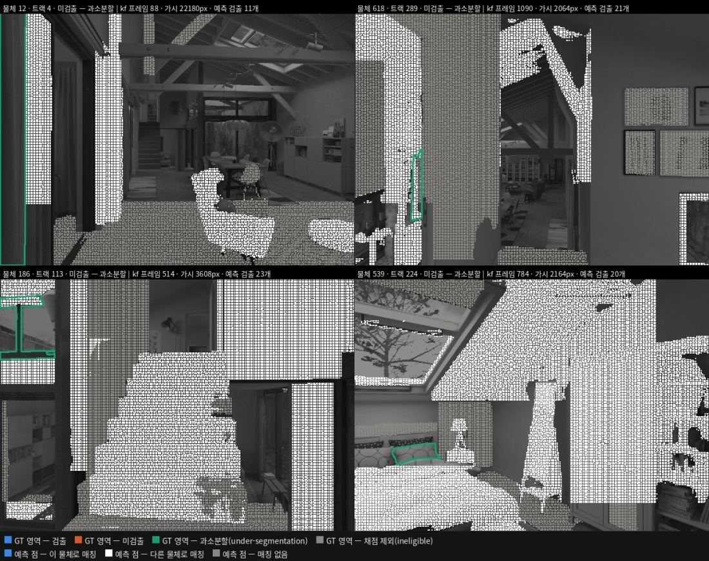

# frontend 평가 (uHumans2)

frontend 가 **놓친 물체**와 **탐지한 물체의 위치 오차(20cm 안인지)** 를 uHumans2 6개 시퀀스에서 채점하고, 결과를 지도와 이미지로 보여 줍니다.
카메라 위치는 GT(ground truth, 정답) pose 를 넣기 때문에 SLAM 오차가 빠진 frontend 단독 성능이 나옵니다.



*맵 화면 — 시퀀스 전체의 GT 물체를 판정 색으로 봅니다. 파랑 검출 · 주황 미검출 · 청록 과소분할 · 회색 빗금 채점 제외.*

```bash
bash frontend_benchmark/eval.sh score     # 채점 (GPU 없이, 바뀐 게 없으면 약 2초)
bash frontend_benchmark/eval.sh viewer    # 뷰어 만들기 → runs/frontend_eval/viewer/index.html
```

## 무엇을 보여 주나

| 보고 싶은 것 | 어디서 |
|---|---|
| 시퀀스별 점수 한 장 | `runs/frontend_eval/status.md` (팀 공유용) |
| 자세한 채점표 | `runs/frontend_eval/summary.md` |
| 어떤 물체를 왜 놓쳤나 | 뷰어 `viewer/index.html` → 시퀀스 → 맵에서 물체 클릭 |
| 그 판정이 어느 장면인가 | 뷰어의 판정 줄 클릭 → 그 keyframe 이미지로 이동 |



*물체를 고르면 놓친 이유와 keyframe 별 판정이 나오고, 줄을 누르면 그 장면으로 갑니다.*



*keyframe 화면 — GT 는 선(윤곽), frontend 예측은 면(마스크)입니다. 선 모양이 다르면 판정이 다릅니다.*

## 작업 세 가지

### (a) 지금 결과 보기

```bash
bash frontend_benchmark/eval.sh score
bash frontend_benchmark/eval.sh viewer
```

뷰어 목록 페이지는 브라우저로 그냥 열면 됩니다(서버 필요 없음). 표만 다시 보려면 `eval.sh show`.
뷰어에서 판정·종류·미검출 원인으로 거르면 맞지 않는 물체는 지우지 않고 흐리게 두고 개수를 보여 줍니다.

### (b) 내 frontend 변경 평가하기

`src/meridian_frontend` 를 고친 뒤:

```bash
bash frontend_benchmark/eval.sh --dry-run    # 무엇을 다시 할지 계획만 보기
GPU=1 bash frontend_benchmark/eval.sh all    # frontend 부터 전부 다시 (약 40~50분)
```

- `score` 만 돌리면 **옛 frontend 출력을 채점합니다.** 그때는 경고가 붙고 종료 코드 4 로 끝납니다. 그대로 쓰려면 `score --accept-stale`.
- 다시 돌릴지는 파일 시각이 아니라 출처 기록(코드 · frontend 소스 · 엔진 · 데이터셋)으로 정합니다. 주석만 고친 것은 다시 돌지 않습니다.
- GPU 단계는 허락을 받고 시작합니다. 한 시퀀스만 보려면 `GPU=1 bash frontend_benchmark/eval.sh run office_06h`.

### (c) 이전과 비교

```bash
bash frontend_benchmark/eval.sh history         # 보관된 이전 결과 목록
bash frontend_benchmark/eval.sh compare latest  # 직전 결과 ↔ 지금 결과
```

`summary.json` 의 값이 바뀔 때만 직전 결과를 `runs/frontend_eval/history/<시각>/` 에 보관합니다. `compare` 는 시퀀스 × 지표 변화표를 찍고, 좋아짐·나빠짐을 지표 방향에 맞춰 적습니다.

## 준비 (한 번만)

| 무엇 | 기본 경로 | 없으면 |
|---|---|---|
| uHumans2 언팩본 | `<WS>/datasets/unpacked/uHumans2_<시퀀스>` | 팀에서 언팩본 사본을 받는 편이 빠릅니다. bag 이 있으면 `tools/unpack_uhumans2.py`. 다른 곳이면 `FB_DATA` |
| GT tracklet h5 | `<WS>/src/meridian/meridian_benchmark/tracklets` | 팀 저장소 `neoul-ro/meridian_benchmark` 의 `tracklets/`. 다른 곳이면 `FB_GT` |
| TensorRT 엔진 (frontend 다시 돌릴 때만) | `<WS>/models/frontend_rtx3060/` | `bash frontend_benchmark/eval.sh engines` 로 **이 PC 에서 빌드**합니다 (약 3.5분) |
| venv · ROS | `tools/env.sh` | `eval.sh` 가 알아서 잡습니다 |

- **엔진은 장비마다 다시 빌드합니다.** 팀 릴리스 `frontend-engines-20260915` 는 로봇(Jetson Orin · TensorRT 10.3) 빌드라 x86 에서는 로드되지 않습니다(`Platform specific tag mismatch`).
- 엔진 빌드 입력은 ONNX 2개입니다. `FastSAM-s-1024.onnx` 는 `neoul-ro/meridian_seg` 의 `weights/` 에 있고, `clip_vit_b32_visual_pooled.onnx` 는 `neoul-ro/meridian_clip` 의 `download_weights.py` → `export_onnx.py --part visual_pooled` 로 만듭니다.
- **이 PC 전용 설정**은 `frontend_benchmark/local.env` 에 `KEY=VALUE` 로 적습니다(git 에 올라가지 않음). 환경변수가 항상 이깁니다.
  `FB_STATUS_COPY` 를 적어 두면 `status.md` 사본을 그 경로에 갱신합니다 — 기본 결과 폴더에서 **전체** 시퀀스를 채점했을 때만 복사합니다.
- TrackEval 은 추적 대조 테스트 하나에만 씁니다. `pip install git+https://github.com/JonathonLuiten/TrackEval@12c8791` 또는 `TRACKEVAL_PATH=<경로>`. 없으면 그 테스트만 건너뜁니다.

## 문제 해결

| 증상 | 할 일 |
|---|---|
| `알 수 없는 명령입니다` (종료 2) | 화면의 "혹시 이 명령인가요?" 를 보거나 `eval.sh help` |
| `그런 시퀀스가 없습니다` · `여러 개와 맞습니다` (종료 2) | 후보 중 하나를 고르거나 전체 이름(`office_s1_06h`)을 씁니다 |
| `이 스크립트는 bash 로 실행해 주세요` | `sh` 말고 `bash` 로 실행합니다 |
| `데이터셋이 없습니다` · `GT h5 가 없습니다` (종료 2) | 준비 표의 경로를 확인합니다. 누락 이유는 `summary.md` 에도 적힙니다 |
| `TensorRT 엔진 없음` · `Platform specific tag mismatch` | `eval.sh engines` 로 이 PC 에서 빌드합니다 |
| GPU 허락 없이 멈춤 (종료 3) | 다시 돌리려면 `GPU=1 … all`, 채점만 하려면 `eval.sh score` |
| 오래된 frontend 출력으로 채점 (종료 4) | `GPU=1 … all` 로 다시 돌리거나 `score --accept-stale` |
| `중단됨` (종료 130) | 다시 실행하면 끝난 단계부터 이어서 합니다 |
| 채점이 오래 걸림 | 처음부터면 6개에 약 15분, 바뀐 게 없으면 약 2초입니다 |

## 참고

- **지표 정의 · 매칭 기준 · JSON/CSV 키**: [docs/METRICS.md](docs/METRICS.md)
- **바뀐 이력**: [docs/HISTORY.md](docs/HISTORY.md)
- **명령 전체**: `bash frontend_benchmark/eval.sh help`

| 명령 | 무엇 |
|---|---|
| `score [시퀀스...]` | 채점 (GPU 없이) |
| `viewer [시퀀스...]` | 뷰어 만들기 |
| `compare [id\|latest]` · `history` | 이전 결과와 비교 · 보관 목록 |
| `show` · `status` | 채점표 앞부분 · `status.md` 만 다시 |
| `examples [시퀀스...]` | 판정 그림 |
| `test [파일...]` | 자체 검증 (`test_*.py` 전부) |
| `engines` · `run <시퀀스...>` · `all` | 엔진 빌드 · 그 시퀀스 전체 · 전부 (GPU) |

- 옵션: `--dry-run` · `--gpu` · `--force` · `--accept-stale`
- 종료 코드: `0` 성공 · `1` 실패 · `2` 사용법·입력 문제 · `3` GPU 허락 없음 · `4` 오래된 출력 · `130` 중단
- 환경변수: `MERIDIAN_WS` · `FB_DATA` · `FB_GT` · `FB_RUNS` · `FB_MODELS` · `FB_AUTHOR`
- 시퀀스 이름은 `office_06h` · `06h` · `office_s1_06h` 를 다 받습니다.

<details>
<summary>판정 그림 예시 — 펼쳐 보기</summary>



*`examples/` 판정 그림 — 원인별 사례를 한 장에 모읍니다. 이 그림은 과소분할로 놓친 물체 4개입니다.*

</details>
